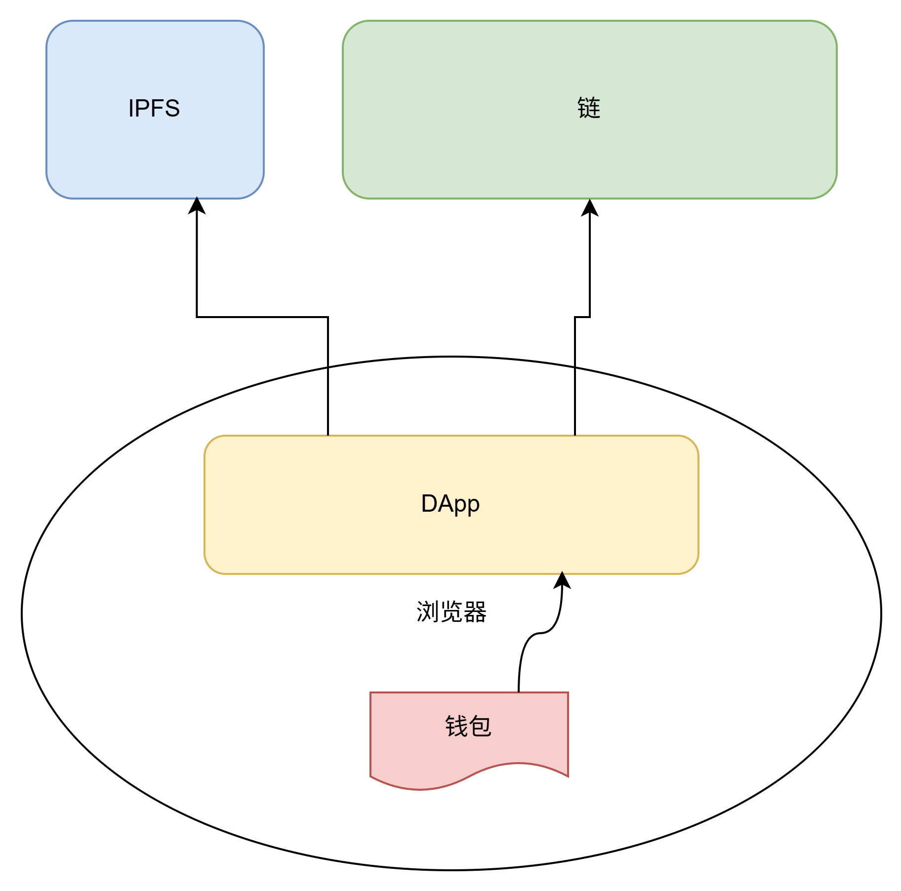

# ebay-eth-final 电商拍卖完整版

day12 完整版：在 ebay-eth 基础上增加 IPFS 图片/描述上传。

技术栈：**Solidity 0.8.26 + Foundry**（合约） / **React 18 + Vite + pnpm**（前端） / **web3.js 4.x** / **kubo-rpc-client**（IPFS）



## 环境

- Node.js 18+（WSL 建议用 Ubuntu 自带 `/usr/bin/node`）
- pnpm 9+（`corepack enable` 或 `npm i -g pnpm`）
- [Foundry](https://book.getfoundry.sh/)
- Anvil（本地链，默认 :8545）
- MetaMask（可选，无钱包时直连 Anvil RPC）
- IPFS daemon（5001，上传商品图片时需要）

## 环境配置

```bash
# 合约部署（项目根目录）
cp .env.example .env
# 部署后把合约地址写入 .env 的 CONTRACT_ADDRESS

# 前端（frontend 目录）
cp frontend/.env.example frontend/.env
# 将 CONTRACT_ADDRESS 同步为 VITE_CONTRACT_ADDRESS
```

| 根目录 `.env` | 说明 |
|------|------|
| `RPC_URL` | Anvil RPC，默认 `http://127.0.0.1:8545` |
| `DEPLOYER_ADDRESS` | 部署账户，默认 Anvil 第一个账户 |
| `CONTRACT_ADDRESS` | `forge script` 部署后的合约地址 |

| `frontend/.env` | 说明 |
|------|------|
| `VITE_RPC_URL` | 同 `RPC_URL` |
| `VITE_CONTRACT_ADDRESS` | 同 `CONTRACT_ADDRESS` |
| `VITE_IPFS_*` | IPFS API 与网关地址 |

## 合约（Solidity 0.8.26）

```bash
cd ebay-eth-final
forge install foundry-rs/forge-std

forge test
npm run build:contract

anvil
npm run deploy:local
```

## 前端（React 18 + Vite + pnpm）

```bash
pnpm install              # 根目录：dotenv-cli 等（workspace 含 frontend）
cp frontend/.env.example frontend/.env
# 填入 VITE_CONTRACT_ADDRESS

# 首次安装若提示 esbuild 构建脚本被忽略：
pnpm approve-builds --all

pnpm dev
```

浏览器打开 http://localhost:5173

```bash
pnpm build    # 生产构建
pnpm preview  # 预览构建结果
```

## 与 ebay-eth 的区别

- 商品 `imageLink` / `descLink` 存 IPFS 哈希
- 前端通过 `kubo-rpc-client` 上传、读取 IPFS

## IPFS

```bash
ipfs daemon   # API 端口 5001，网关建议配置 8848
```

## 目录与架构

```
ebay-eth-final/
├── src/EcommerceStore.sol          # Foundry 合约
├── script/DeployEcommerceStore.s.sol
├── scripts/sync-abi.js             # ABI → frontend/src/eth/abi.json
└── frontend/                       # React 18 + Vite
    ├── src/
    │   ├── config/env.js           # VITE_* 环境变量
    │   ├── constants/product.js    # status / 拍卖阶段枚举
    │   ├── services/
    │   │   ├── web3.js             # Web3 + 合约实例
    │   │   ├── ipfs.js             # IPFS 上传/读取
    │   │   └── ecommerce.js        # 合约方法封装
    │   ├── hooks/
    │   │   ├── useWeb3.jsx         # 全局 Web3 Context
    │   │   ├── useProductList.js   # 商品列表
    │   │   ├── useProductDetail.js # 商品详情 + 拍卖阶段
    │   │   └── useContractTx.js    # 发送交易
    │   ├── components/
    │   │   ├── auction/            # 竞标 / 揭标 / 结算 / 仲裁
    │   │   └── product/            # 商品卡片
    │   └── pages/                  # 路由页面（/, /product/:id, /list-item）
    └── vite.config.js
```

分层说明：

| 层 | 职责 |
|----|------|
| `pages` | 路由入口，组合 hooks 与组件 |
| `hooks` | 状态与副作用（链上读取、交易发送） |
| `services` | Web3 / IPFS / 合约 API，不含 UI |
| `components` | 可复用 UI（对应旧版各 `#bidding` 等表单） |
| `utils` | 格式化、拍卖阶段判断 |


## 密封竞标与防预碰撞

本 DApp 使用密封出价拍卖：先竞标、后揭标，最高价者进入仲裁交割流程。

### 流程

1. **竞标**：本地算出承诺哈希 `commitHash`，链上只提交 `commitHash` + 迷惑转账金额（`msg.value`），理想出价和秘密字符串不上链。
2. **揭标**：提交理想出价和秘密字符串，合约重算 `commitHash`，与竞标时记录比对，一致才生效。

承诺哈希算法（`computeCommitHash`）：

```solidity
keccak256(abi.encode(chainId, address(this), productId, bidder, idealPrice, secret))
```

### 秘密字符串是干什么的

**秘密字符串是为了防止别人猜测，因为本身是由用户支配。**

理想出价一旦被人知道，别人就可能靠穷举秘密字符串去还原你的 `commitHash`。秘密字符串是你自己保管的随机量，别人不知道，猜中的概率极低。页面默认生成 32 字节随机串，不要用 `"123"`、`"abc"` 这种短串。

揭标时必须和竞标时填同一个，否则 hash 对不上。

### 其他字段是干什么的

**其他的才是防止碰撞攻击。**

| 字段 | 作用 |
|------|------|
| `chainId` | 这条链上的承诺不能拿到别的链复用 |
| `address(this)` | 这个合约的承诺不能拿到别的合约复用 |
| `productId` | 这场拍卖的承诺不能拿到别的商品复用 |
| `bidder` | 承诺绑定竞标人地址 |
| `abi.encode` | 不同类型分开编码，避免 `encodePacked` 拼接歧义 |

另外，竞标存到 `bids[msg.sender][commitHash]`。就算两个人算出了相同的 hash，也只能揭自己地址下提交过的标，揭不了别人的。

### 如何防止预碰撞

「预碰撞」指有人提前算好大量 `(理想出价, 秘密字符串)` 组合，试图撞 hash 或揭别人的标。当前实现从三层挡住：

1. **竞标只上链 hash**  
   交易 calldata 里没有理想出价和秘密明文，别人看不到你的 preimage，没法针对你去穷举。

2. **秘密字符串由用户支配**  
   用足够长的随机串（默认 32 字节），搜索空间约 2^256，提前算表不现实。

3. **上下文绑定 + 地址隔离**  
   hash 里写入链 ID、合约、商品 ID、竞标人；存储按 `msg.sender` 分桶。撞出相同 hash 也跨不了账户、跨不了场次。

### 相关合约与测试

- `src/EcommerceStore.sol`：`computeCommitHash`、`bid(productId, commitHash)`、`revealBid`
- `test/EcommerceStore.t.sol`：
  - `testRevealFailsWithWrongSecret` — 秘密错了揭标失败
  - `testCommitCannotReplayOnAnotherProduct` — 换商品不能复用承诺

### 使用注意

- 竞标后请保存**理想出价**和**秘密字符串**，揭标时要一致。
- 合约接口变更后需重新部署，并更新 `CONTRACT_ADDRESS` / `VITE_CONTRACT_ADDRESS`。

