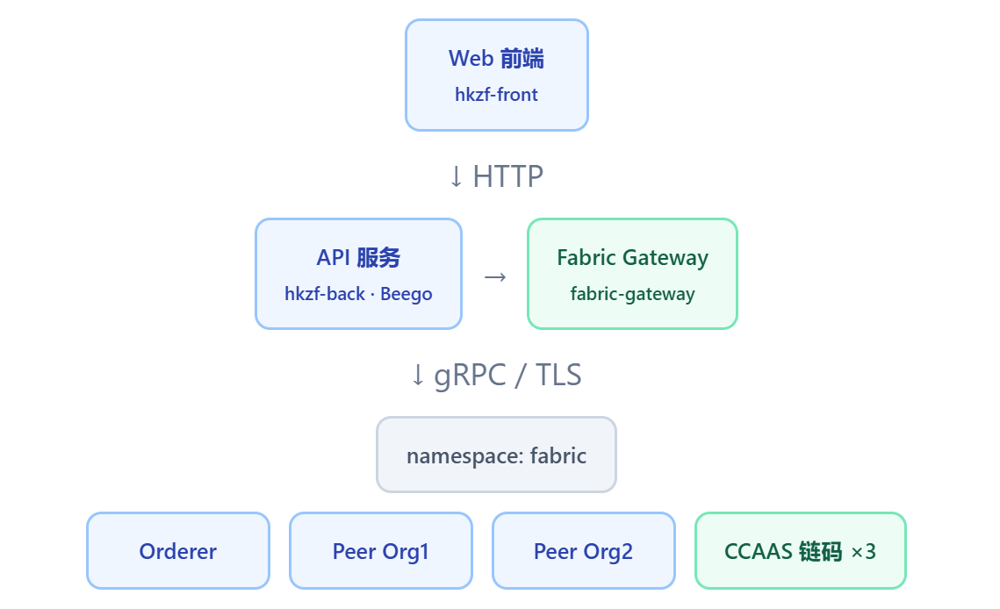
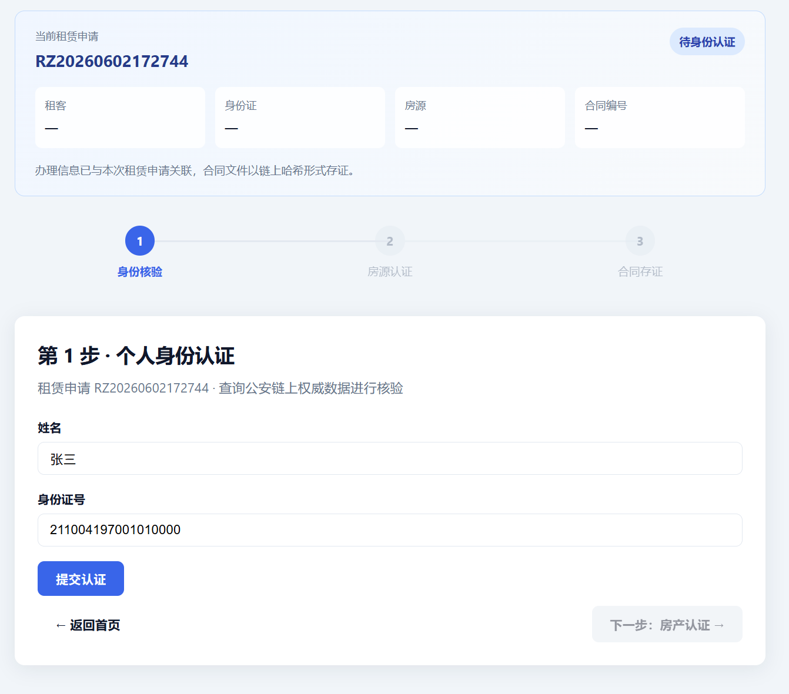
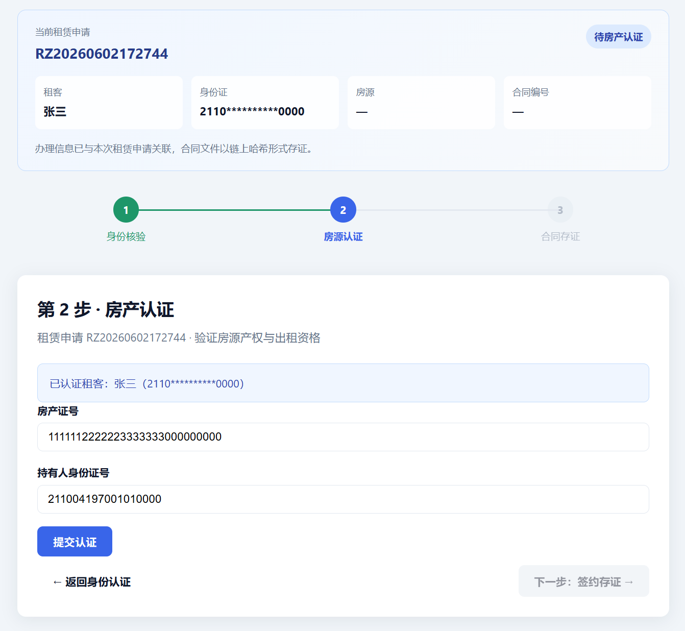
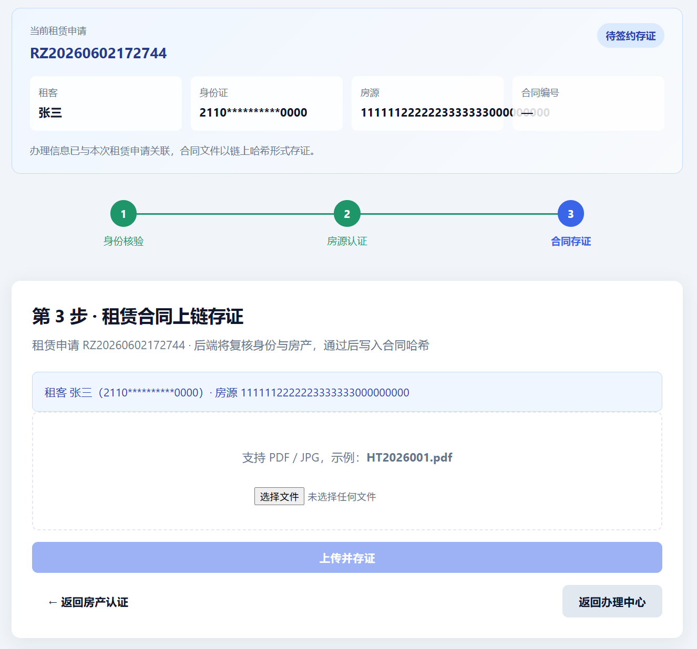

# 链信租房（HKZF）实践报告

---

## 第1章  需求分析

### 1.1  项目背景和意义

随着城镇化进程加快，住房租赁市场规模持续扩大，租房交易中的信任问题日益突出。在传统租房业务中，租客身份是否真实、房产证与持有人是否一致、租赁合同是否被事后篡改等问题，往往依赖中介或纸质材料的人工核对，缺乏权威、可验证的数据支撑，容易引发纠纷，举证成本较高。

区块链具有分布式账本、多方共识、数据不可篡改等特点，适合承载租赁环节中的关键认证结果与合同摘要。本项目基于 Hyperledger Fabric 2.5 构建「链信租房」可信办理平台：管理端维护公安、房管等权威认证数据并写入链上；用户端按序完成身份核验、房产核验与合同存证；后端在合同上链前对前两步进行链上复核，通过后才允许合同哈希写入账本。链上仅存认证结果与合同 SHA256 摘要，不存 CSV 原文与 PDF 全文，在保护隐私的前提下实现可追溯、不可篡改的租赁办理流程。

本项目的实践意义在于：将联盟链技术与真实租房合规流程相结合，完成从需求分析、概要设计到系统实现与集成交付的完整工程实践，为区块链在政务与租赁领域的应用探索提供可演示、可复现的原型参考。

### 1.2  项目主要完成内容

本项目主要完成以下内容：

1. 业务建模与流程设计：明确管理员与用户两类角色分工，设计「身份认证 → 房产认证 → 签约存证」三步办理流程及步骤门禁规则，形成业务模型文档。
2. 区块链网络与链码实现：搭建双组织 Fabric 网络，开发身份、房产、合同三个独立链码（Go · CCAAS），实现认证数据的增删查与合同摘要上链。
3. 应用层开发：基于 Beego 实现 REST API，通过 Fabric Gateway 访问账本；前端实现办理中心、三步业务页面及管理端 CSV 导入功能。
4. 系统集成与交付：完成区块链网络与业务应用的联调部署，形成可端到端演示的办理环境。
5. 验证与说明材料：编写业务与架构说明文档，配套演示样本及反面用例，便于全流程走通与结果对照。

---

## 第2章  概要设计

### 2.1  系统功能框架

本系统按「链与业务分离」思路分层：展示层负责办理向导与管理操作，应用层负责流程编排与链上访问封装，区块链层负责共识、背书与账本存储。管理端写入权威认证数据，用户端按步骤发起核验与存证，合同上链前由应用层再次核对前两步结果，避免跳步办理。链侧与业务侧在部署上相互独立，便于分别升级与排错。

系统功能框架如下图所示。

图 1  系统功能框架图



### 2.2  功能模块说明

系统划分为四个功能模块：权威数据管理、租赁办理流程、区块链存证与核验、系统部署与演示。前三个模块对应业务主线，第四个模块保障环境交付与现场展示。模块之间通过应用层接口衔接，用户侧只感知办理步骤，不直接操作链。

#### 1．权威数据管理模块

该模块面向管理员，承担公安身份与房管房产两类权威数据的维护，是用户端核验的数据来源。

设计要点是「管理端写、用户端查」：权威数据由管理方批量导入并上链，普通用户只能发起查询，不能改写底账。身份数据记录姓名与不良记录标记，房产数据记录产权关联与可出租状态。导入采用异步写链，避免大批量数据阻塞页面操作。只有底账就绪后，用户办理中心的身份、房产两步才有可查依据。

#### 2．租赁办理流程模块

该模块面向租客，把链上操作收敛为「身份认证 → 房产认证 → 签约存证」三步向导。

用户从办理中心生成租赁申请单号，按步骤填写信息并查看核验结果；未通过上一步不得进入下一步，步骤条与页面跳转均受门禁约束。办理进度在本地会话中保存，首页可显示当前处于哪一阶段，支持中断后继续。前端门禁与后端在合同上链前的链上复核相互配合，降低跳步办理的风险。

#### 3．区块链存证与核验模块

该模块是链与业务的衔接层，按业务类型拆分为身份、房产、合同三个链码，分别处理查询核验与摘要存证。

身份与房产链码以查为主，返回是否匹配及业务标记；合同链码只存文件哈希，不存 PDF 原文。合同提交时，应用层须再次确认前两步已在链上通过，才允许写入摘要。写链操作经双组织背书，保证通道内数据一致；读链用于界面展示与结果核对。

#### 4．系统部署与演示模块

该模块主要解决两个问题：一是把区块链网络和业务系统装到可运行的环境里，二是准备可重复演示的样本与说明。

部署时，将链网络与业务应用分开配置，既可整体启动，也可单独更新其中一部分，方便在联调阶段分别检查链上写入和页面办理是否正常。链侧完成节点、通道与链码的运行环境搭建；应用侧完成接口与页面的发布，使管理端和用户端能通过浏览器访问。

演示时，准备了与三步办理流程对应的样例数据和简要操作说明，便于按「先导入权威数据、再用户逐步办理」的顺序完整走一遍。同时整理了系统功能与架构说明，方便自己回顾和给别人讲清楚整条链路。

---

## 第3章  系统功能实现

### 1．身份认证模块

身份认证模块基于 `authentication` 链码实现个人身份的链上核验。链码以身份证号为 Key，以「姓名:是否有不良记录」为 Value 存储；用户查询时传入姓名与身份证号，返回「是否匹配:是否有不良记录」格式的结果。

核心负责身份数据的 `check` 与 `add` 操作，通过链码 `Invoke` 路由分发，避免业务逻辑分散。

```go
// 身份认证链码核心逻辑（chaincode/authentication/main.go）
func (this *Auth) check(stub shim.ChaincodeStubInterface, args []string) peer.Response {
    name := args[0]
    id := args[1]
    data, err := stub.GetState(id)
    if err != nil {
        return shim.Error(err.Error())
    }
    if data != nil {
        split := strings.Split(string(data[:]), ":")
        result := "false"
        if split[0] == name {
            result = "true"
        }
        result = result + ":" + split[1]
        return shim.Success([]byte(result))
    }
    return shim.Success([]byte("false:false"))
}
```

用户端通过 `GET /api/auth?name=张三&id=211004197001010000` 调用后端，后端经 Gateway 查询链码并返回结果。通过条件为身份匹配且不良记录为 `false`（即返回 `true:false`）。

图 2  身份认证模块界面图



### 2．房产认证模块

房产认证模块基于 `certification` 链码实现房产产权与可出租资格的链上核验。管理端上传 `house.csv` 后，链上以房产证号为 Key，以「身份证号:是否可出租」为 Value 存储数据。

```go
// 后端房产核验封装（hkzf-back/controllers/verify.go）
func verifyHouseOnChain(houseId, id string) (bool, string) {
    data, err := models.Query(
        beego.AppConfig.String("chaincode_id_house"),
        "check",
        [][]byte{[]byte(houseId), []byte(id)},
    )
    if err != nil {
        return false, err.Error()
    }
    first, second := parseBoolPair(string(data))
    if !first {
        return false, "产权人与身份证不匹配，或链上无该房产记录"
    }
    if !second {
        return false, "该房产不具备出租资格"
    }
    return true, ""
}
```

用户端通过 `GET /api/house?houseId=...&id=...` 完成核验。前端通过 `HKZF.guardStep(2)` 确保仅在上一步身份认证通过后可进入本模块页面。

图 3  房产认证模块界面图



### 3．合同存证模块

合同存证模块在用户上传合同文件时，先由后端链上复核身份与房产，通过后将文件 SHA256 摘要写入 `contract` 链码，实现防篡改存证。

```go
// 合同上链核心逻辑
func (this *ContractController) SetValue() {
    name := this.GetString("name")
    id := this.GetString("id")
    houseId := this.GetString("houseId")

    if ok, msg := verifyAuthOnChain(name, id); !ok {
        handleResponse(this.Ctx.ResponseWriter, 403, msg)
        return
    }
    if ok, msg := verifyHouseOnChain(houseId, id); !ok {
        handleResponse(this.Ctx.ResponseWriter, 403, msg)
        return
    }

    file, header, err := this.GetFile("contract")
    // ...
    key := strings.Split(header.Filename, ".")[0]
    hash := sha256.New()
    io.Copy(hash, file)
    hashHex := hex.EncodeToString(hash.Sum(nil))
    _, err = models.Invoke(beego.AppConfig.String("chaincode_id_contract"), "set",
        [][]byte{[]byte(key), []byte(hashHex)})
    handleResponse(this.Ctx.ResponseWriter, 200, hashHex)
}
```

链上 Key 为合同编号（文件名去掉扩展名），Value 为十六进制哈希字符串。用户可通过 `GET /api/contract?contractId=HT2026001` 查询链上存证结果。

图 4  合同存证模块界面图



---

## 总  结

本项目侧重区块链系统框架开发。当前版本验证的是联盟链应用从部署到办理闭环的技术可行性；业务本身并不复杂，但从需求到能跑通演示，整条链路已基本走通。本版由管理端导入公安、房管数据，用户端按身份、房产、合同三步办理，合同仅将 SHA256 上链，链上不存 CSV 与 PDF 原文。真实场景下，需由多家权威机构分别运维节点、分别承担写入与背书责任，才能把「单方不可独自改账本」落到业务上，而不是仅靠单平台后端查库。

实现上，身份、房产、合同拆成三个链码，用 Gateway 统一读写，思路清楚。管理端 CSV 批量导入配合延迟写链，大批量数据不会卡页面；用户端有步骤门禁，合同提交时后端还会再查一遍前两步，和前端限制对得上。联调时踩过不少坑：Gateway 连不上、背书策略配错、前端能进页面但后端 403 之类，查日志、对配置花了不少时间，但问题基本都定位到了。

也有明显短板。管理端没有登录和权限，谁都能访问导入页；三步在链上是三条独立记录，靠本地申请单号串起来，链上查不到「这一单办到哪了」；合同只存哈希，不能自动比对 PDF 是否被改过。这些在原型阶段可以接受，真要落地还得补。

回过头看设计，「链与业务分离」是这次做得比较顺的地方：链码只管存和查，流程和门禁放在 Beego 和前端，改页面不用动链码。反过来，部署也比想象中麻烦——Fabric 网络、CCAAS、K8s、业务服务各一套配置，哪一环不对整条链路就断，不能只盯某一个接口。

如果后面再改一版，我会优先做两件事：给管理端加权限，以及把租赁申请单号写进链码，让三步结果在链上能串成一条记录。就现在这个版本来说，该碰的框架都碰过了；离真实租房业务还远，但搭网、写链码、Gateway 对接、联调排错这条线已经走通。
